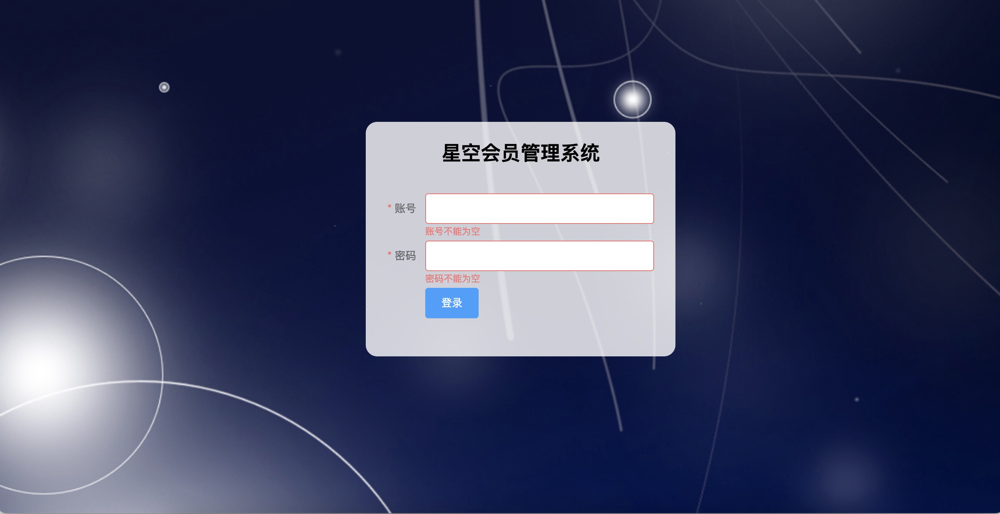

# 星空会员管理系统开发文档

## 一、使用vue-cli创建项目

### 1.1 创建项目

```
vue create admin-system
```

### 1.2 进入项目目录

```
cd admin-system
```

### 1.3 启动项目

```
npm run serve
```

## 二、对项目进行基础配置

> 这块的配置方式有两种: 
>
> 1. 第一种是在index.html中进行配置
> 2. 第二种是通过vue.config.js里面来进行设定

### 2.1 配置网页的标题

`public/index.html`

```html
<!DOCTYPE html>
<html lang="">
  <head>
    <meta charset="utf-8">
    <meta http-equiv="X-UA-Compatible" content="IE=edge">
    <meta name="viewport" content="width=device-width,initial-scale=1.0">
    <link rel="icon" href="<%= BASE_URL %>favicon.ico">
<!--    <title><%= htmlWebpackPlugin.options.title %></title>-->
    <title>星空会员管理系统</title>
  </head>
  <body>
    <noscript>
      <strong>We're sorry but <%= htmlWebpackPlugin.options.title %> doesn't work properly without JavaScript enabled. Please enable it to continue.</strong>
    </noscript>
    <div id="app"></div>
    <!-- built files will be auto injected -->
  </body>
</html>

```

效果截图:


### 2.2 配置网页的icon图标

1. 需要有一张jpg、png格式的图片

2. 使用在线图标生成器转化图标

   http://www.51tool.com/

3. 将转化之后的图标放到`public`文件夹当中

```html
<!DOCTYPE html>
<html lang="">
  <head>
    <meta charset="utf-8">
    <meta http-equiv="X-UA-Compatible" content="IE=edge">
    <meta name="viewport" content="width=device-width,initial-scale=1.0">
    <link rel="icon" href="<%= BASE_URL %>favicon.ico">
<!--    <title><%= htmlWebpackPlugin.options.title %></title>-->
    <title>星空会员管理系统</title>
  </head>
  <body>
    <noscript>
      <strong>We're sorry but <%= htmlWebpackPlugin.options.title %> doesn't work properly without JavaScript enabled. Please enable it to continue.</strong>
    </noscript>
    <div id="app"></div>
    <!-- built files will be auto injected -->
  </body>
</html>

```

最终效果:


### 2.3 在vue.config.js对项目进行配置

1. 关闭eslint代码检测
2. 启动的端口号
3. 配置主机名
4. 配置浏览器自动打开
5. 配置https协议默认不开启

```javascript
module.exports = {
  // 配置服务器
  devServer : {
    // 启动的端口号
    port : 9999,
    // 主机名
    host : "localhost",
    // 是否开启https
    https : false,
    // 浏览器自动打开
    open : true
  },
  // 关闭eslint代码质量检测
  lintOnSave : false
}

```


### 2.4 安装axios

```
npm i axios --save
```


### 2.5 配置跨域

1. ###### 什么是同源?

   如果两个页面（接口）的协议、域名、端口号都相同，我们认为他们具有相同的源

2. ###### 什么是同源策略?

   同源策略就是浏览器的一个安全限制，它阻止了不同【域】之间进行的数据交互

3. ###### 安全限制具体都组织了那些东西不可以被访问?

   1.无法读取非同源策略下的cookie、localstorage

   2.无法解除非同源的dom 

   3.无法向非同源的地址发送ajax请求

4. ###### 想要进行数据交互怎么办？

   跨域: 

   	1. jsonp 
    	2. cors 后端允许跨域
    	3. iframe
    	4. 代理 (vue采用的就是这种方式)

#### 2.5.1 演示跨域


#### 2.5.2 配置跨域

`vue.config.js`

```javascript
/**
 * @author YangLing
 * @date 2022/5/19 2:23 PM
 */
module.exports = {
  // 配置服务器
  devServer : {
    // 启动的端口号
    port : 9999,
    // 主机名
    host : "localhost",
    // 是否开启https
    https : false,
    // 浏览器自动打开
    open : true,
    // 配置跨域
    proxy : {
      //  "/dev-api" 代理名称， 当我们请求"/dev-api"的时候就相当于请求http://localhost:8888
      "/dev-api" : {
        // target 后面写的是要跨域的地址
        target : "http://localhost:8888",
        // 开启跨域
        changeOrigin : true,
        // 代理路径重写
        pathRewrite : {
          "^/dev-api" : ""
        }
      }
    }
  },
  // 关闭eslint代码质量检测
  lintOnSave : false
}


```

效果演示: 


#### 2.5.3 结合环境变量文件去配置跨域

1. 创建`.env.development`

   ```
   # 代理名称
   VUE_APP_BASE_API = "/dev-api"
   
   # 代理地址
   VUE_APP_SERVICE_URL = "http://member.9yuecloud.com:8889"
   
   ```

   

2. 创建`.env.production`

   ```
   # 代理名称
   VUE_APP_BASE_API = "/pro-api"
   ```

   


3. `vue.config.js`

   ```javascript
   /**
    * @author YangLing
    * @date 2022/5/19 2:23 PM
    */
   module.exports = {
     // 解决打包之后白屏的问题
     publicPath : "./",
     // 配置服务器
     devServer : {
       // 启动的端口号
       port : 9999,
       // 主机名
       host : "localhost",
       // 是否开启https
       https : false,
       // 浏览器自动打开
       open : true,
       // 配置跨域
       proxy : {
         //  "/dev-api" 代理名称， 当我们请求"/dev-api"的时候就相当于请求http://localhost:8888
         // "/pro-api" : {
         [process.env.VUE_APP_BASE_API] : {
           // target 后面写的是要跨域的地址
           target : process.env.VUE_APP_SERVICE_URL,
           // 开启跨域
           changeOrigin : true,
           // 代理路径重写
           pathRewrite : {
             ["^" + process.env.VUE_APP_BASE_API] : ""
           }
         }
       }
     },
     // 关闭eslint代码质量检测
     lintOnSave : false
   }
   ```

   

### 2.6 配置线上跨域

 1. 打包项目

    ```
    npm run build
    ```

	2. 把打包之后的dist文件的内容扔到服务器上面

	3. 配置线上跨域

    


## 三、axios二次封装

1. 引入axios
2. 创建axios实例对象
3. 创建请求拦截器
4. 创建响应拦截器
5. 导出axios实例对象

`utils/request.js`

```javascript
/**
 * @author YangLing
 * @date 2022/5/19 4:00 PM
 */
// 引入axios
import axios from "axios"

// 创建axios实例对象
const service = axios.create({
  // 请求的公共接口地址， 如果配置了跨域，我们baseURL一般写的是跨域的代理名称
  baseURL : process.env.VUE_APP_BASE_API,
  timeout : 10000
});

// 添加请求拦截器
service.interceptors.request.use(function (config) {

  return config;
}, function (error) {

  return Promise.reject(error);
});

// 添加响应拦截器
service.interceptors.response.use(function (response) {

  return response;
}, function (error) {

  return Promise.reject(error);
});

// 导出axios实例对象
export default service


```


## 四、API接口封装

1. api封装

   ```javascript
   /**
    * @author YangLing
    * @date 2022/5/19 4:08 PM
    */
   
   import service from "../utils/request"
   
   const login = (data)=>{
       return service({url : "/v2/admin/login", method : "POST", data})
   }
   
   export default {
     login
   }
   
   ```

   

2. api调用

   ```javascript
   methods : {
      async handleSend(){
         // .then .catch .all .race promise独有的方法
        const res = await User.login({username:"admin", password : "admin"})
        console.log(res)
       }
     }
   ```


## 五、处理不管是GET请求还是POST请求方式都可以使用data进行传参

`src/utils/request.js`

```javascript
/**
 * @author YangLing
 * @date 2022/5/19 4:00 PM
 */

// 引入axios
import axios from "axios"

// 创建axios实例对象
const service = axios.create({
  // 请求的公共接口地址， 如果配置了跨域，我们baseURL一般写的是跨域的代理名称
  baseURL : process.env.VUE_APP_BASE_API,
  timeout : 10000
});

// 添加请求拦截器
service.interceptors.request.use(function (config) {

  return config;
}, function (error) {

  return Promise.reject(error);
});

// 添加响应拦截器
service.interceptors.response.use(function (response) {

  return response;
}, function (error) {

  return Promise.reject(error);
});

// 处理get请求方式的参数问题
// 如果请求的方式为get方法， 我们就把调用方data的参数赋值给params，这样就能够解决我们不管是使用get还是post我们都可以在调用方使用data去进行传参
function request(options){
  // 如果我们没有传递options.method的这属性， 我们就给options.method的默认值为get
  options.method = options.method || "get"
  if(options.method.toLowerCase() === 'get'){
     options.params = options.data
  }
  return service(options)
}


// 导出axios实例对象
export default request


```

## 六、创建登录组件以及配置登录路由


## 七、处理项目的公共样式以及低版本浏览器的兼容性问题

`src/style/reset.css`

```css
/**
 * Eric Meyer's Reset CSS v2.0 (http://meyerweb.com/eric/tools/css/reset/)
 * http://cssreset.com
 */

html, body, div, span, applet, object, iframe,
h1, h2, h3, h4, h5, h6, p, blockquote, pre,
a, abbr, acronym, address, big, cite, code,
del, dfn, em, img, ins, kbd, q, s, samp,
small, strike, strong, sub, sup, tt, var,
b, u, i, center,
dl, dt, dd, ol, ul, li,
fieldset, form, label, legend,
table, caption, tbody, tfoot, thead, tr, th, td,
article, aside, canvas, details, embed,
figure, figcaption, footer, header, hgroup,
menu, nav, output, ruby, section, summary,
time, mark, audio, video{
    margin: 0;
    padding: 0;
    border: 0;
    font-size: 100%;
    font: inherit;
    font-weight: normal;
    vertical-align: baseline;
}
/* HTML5 display-role reset for older browsers */
article, aside, details, figcaption, figure,
footer, header, hgroup, menu, nav, section{
    display: block;
}
ol, ul, li{
    list-style: none;
}
blockquote, q{
    quotes: none;
}
blockquote:before, blockquote:after,
q:before, q:after{
    content: '';
    content: none;
}
table{
    border-collapse: collapse;
    border-spacing: 0;
}

/* custom */
a{
    color: #7e8c8d;
    text-decoration: none;
    -webkit-backface-visibility: hidden;
}
::-webkit-scrollbar{
    width: 5px;
    height: 5px;
}
::-webkit-scrollbar-track-piece{
    background-color: rgba(0, 0, 0, 0.2);
    -webkit-border-radius: 6px;
}
::-webkit-scrollbar-thumb:vertical{
    height: 5px;
    background-color: rgba(125, 125, 125, 0.7);
    -webkit-border-radius: 6px;
}
::-webkit-scrollbar-thumb:horizontal{
    width: 5px;
    background-color: rgba(125, 125, 125, 0.7);
    -webkit-border-radius: 6px;
}
html, body{
    width: 100%;
    font-family: "Arial", "Microsoft YaHei", "黑体", "宋体", "微软雅黑", sans-serif;
}
body{
    line-height: 1;
    -webkit-text-size-adjust: none;
    -webkit-tap-highlight-color: rgba(0, 0, 0, 0);
}
html{
    overflow-y: scroll;
}

/*清除浮动*/
.clearfix:before,
.clearfix:after{
    content: " ";
    display: inline-block;
    height: 0;
    clear: both;
    visibility: hidden;
}
.clearfix{
    *zoom: 1;
}

/*隐藏*/
.dn{
    display: none;
}


```

## 八、实现登录页面布局

`src/views/login/index.vue`

```vue
<template>
  <div class="container">
    <div class="center">
      <h3 class="title">星空会员管理系统</h3>

      <el-form ref="form" :model="loginForm" label-width="40px">
        <el-form-item label="账号">
          <el-input v-model="loginForm.username"></el-input>
        </el-form-item>
        <el-form-item label="密码">
          <el-input type="password" v-model="loginForm.password"></el-input>
        </el-form-item>
        <el-form-item>
          <el-button type="primary">登录</el-button>
        </el-form-item>
      </el-form>
    </div>
  </div>
</template>

<script>
export default {
  name: 'index',
  data(){
    return {
      loginForm : {
        username : "",
        password : ""
      }
    }
  }
};
</script>

<style scoped>
.container{
  width: 100%;
  height: 100%;
  background: url("http://vue.mengxuegu.com/img/login.b665435f.jpg") no-repeat;
}
.center{
  width: 350px;
  height: max-content;
  background-color: rgba(255,255,255,0.6);
  position: absolute;
  left : 50%;
  top : 160px;
  margin-left: -175px;
  padding: 28px;
  border-radius: 15px;
}
.title{
  font-size: 26px;
  font-weight: 700;
  text-align: center;
}
.el-form{
  margin-top:40px;
}
</style>

```

最终效果:


## 九、登录功能

### 9.1 表单校验

`src/views/login/index.vue`

```vue
<el-form ref="form" :rules="rules" :model="loginForm" label-width="50px">

        <el-form-item label="账号" prop="username">
          <el-input v-model="loginForm.username"></el-input>
        </el-form-item>

        <el-form-item label="密码" prop="password">
          <el-input type="password" v-model="loginForm.password"></el-input>
        </el-form-item>

        <el-form-item>
          <el-button type="primary">登录</el-button>
        </el-form-item>

 </el-form>
 
<script>
export default {
  name: 'index',
  data(){
    return {
      loginForm : {
        username : "",
        password : ""
      },
      rules : {
        username : [
          {required : true, message : "账号不能为空", trigger : "blur"},
          { min: 3, max: 10, message: '长度在 3 到 10 个字符', trigger: 'blur' }
        ],
        password : [
          {required : true, message : "密码不能为空", trigger : "blur"}
        ]
      }
    }
  },
  methods : {
    handleLoginSubmit(){
      this.$refs["loginForm"].validate(valid=>{
        if(!valid) return
      })
    }
  }
};
</script>
```

最终效果:



### 9.2 登录功能

1. 点击登录按钮,获取到输入的用户名和密码
2. 调用登录接口,将获取到的用户名和密码提交到后台
3. 登录成功之后后台会返回相关的信息,其中有一个参数为token,我们需要将token保存到vuex和本地
4. 调用获取用户信息接口
5. 获取用户信息成功之后我们需要将获取到用户信息存储到vuex和本地
6. 保存成功之后,跳转到主页
7. 登录失败,我们需要进行一个失败的信息提示

